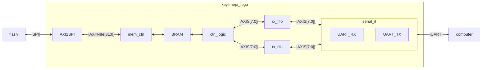
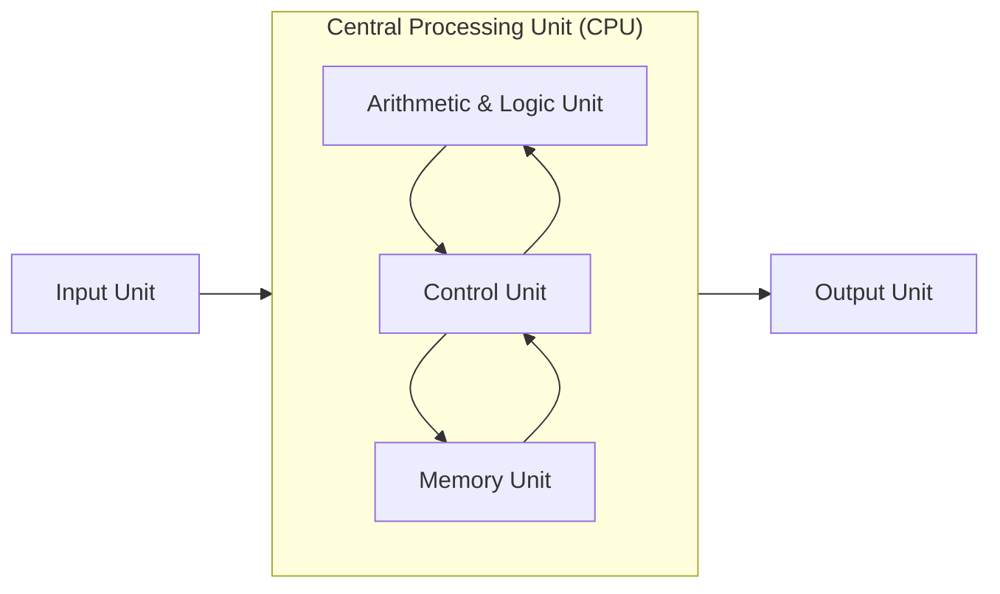

# FPGA Code
- The main product's logic will go through the FPGa
## Design

```mermaid
flowchart LR
    flash
    subgraph keylimepi_fpga
        direction TB
        AXI2SPI
        mem_ctrl
        BRAM
        ctrl_logic
        rx_fifo
        tx_fifo
        subgraph serial_if
            UART_RX
            UART_TX
        end
    end
    computer

    flash<--|SPI|-->AXI2SPI
    AXI2SPI<--|AXI4-lite[31:0]-->mem_ctrl<-->BRAM<-->ctrl_logic
    ctrl_logic<--|AXIS[7:0]|-->rx_fifo & tx_fifo<--|AXIS[7:0]|-->serial_if
    serial_if<--|UART|-->computer
```

## Example

```mermaid
flowchart LR
    subgraph CPU["Central Processing Unit (CPU)"]
        direction TB
        ArithmeticUnit["Arithmetic & Logic Unit"]
        ControlUnit["Control Unit"]
        MemoryUnit["Memory Unit"]
        
        ArithmeticUnit-->ControlUnit-->ArithmeticUnit
        MemoryUnit-->ControlUnit-->MemoryUnit
    end
    InputUnit["Input Unit"]-->CPU 
    CPU-->OutputUnit["Output Unit"]
```