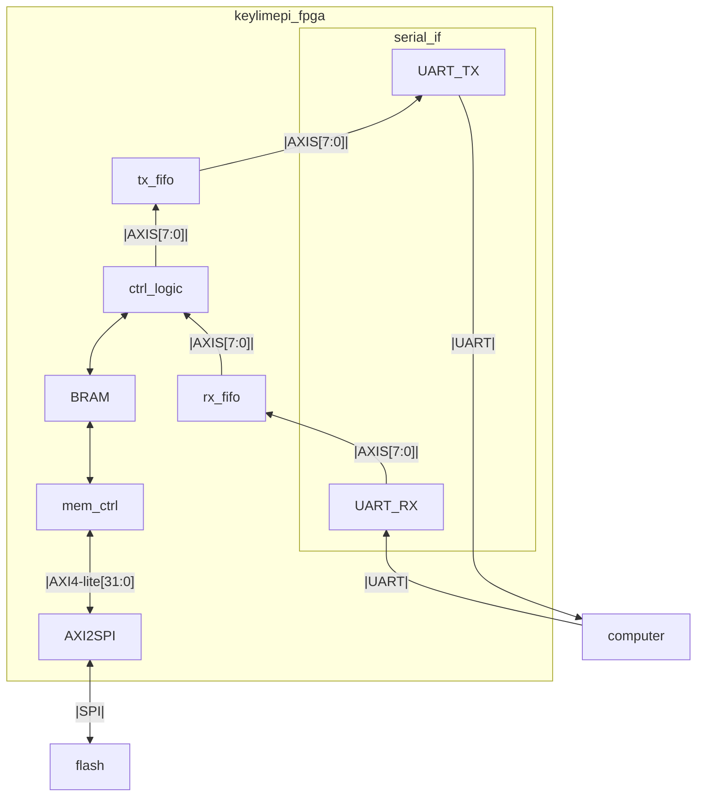

# Keylime Pi
Password manager and 2FA token on an FPGA.
## History
This project started off as a hackathon project (which we won first place) that my friends and I worked on. It revolved around using a Raspberry pi that would connect through usb. The client computer would start an automated ssh session with the raspberry pi and called python scripts on it. As you can imagine, this was very inefficient, as it would take awhile to wait for any reads and writes.

Due to my love of FPGAs and digital design, I decided to go with an FPGA approach, using programmable logic to make it more efficient.
## Design
The end product consists of a pcb that connects to the user's computer through usb. The pcb will contain a flash chip, an FPGA, and ic to translate uart signals to usb.

For communication with the FPGA, I decided to use uart, since its fairly simple and the slower speeds should not be too much of an issue since not alot of data will need to go back and forth during run time. I created a custom command protocol on top of that to be efficient with how many bytes would need to be sent at a time.

In terms of storage, the domain names, usernames, and passwords will all be stored in BRAM during runtime, but will be stored permanently on the flash. Once the FPGA is booted and brought out of reset, a module loads up the BRAM by reading every address of the flash and writing it to the BRAM. Then, during runtime, while the control logic is not performing a read or write, the memory control will go through each address of the BRAM and write that data back to the flash. That way there is no concern of stale data if the usb is unexpectedly unplugged.

Something I still need to design is how to boot the FPGA. My preliminary thought is to have the user store the bit file with their application, and have the application boot the FPGA. That way any updates could also be an update of the bit file to address any security concerns. I still need to figure out a way to boot the bit file on the FPGA without needing to use vivado.
# FPGA Code
- Vivado 2025.2
- Chip name: XC7S50CSGA324-1
## Block Design
Below is a block design of the full FPGA code and what it interacts with.

### Known Issues
- The address is limited to 8 bits, so not used to the fullest possible 12 bits.
- Would like to support timeouts and other errors the rtl detects to prevent hanging in python and support error codes.
- Always expects 64 bytes is written or read at a time, in the future could maybe have an extra byte or two that gives length of data to avoid wasting cycles with empty bytes
### How to Build
1. Enter the `build/` directory
2. Run the build scripts
    1. If you want the bitstream, you can just run `make all` or just `make. **NOTE**: You must have a locally built project before you can generate the bit file.
    2. If you want to just create the project, run `make project`
    3. If you've already created the project and don't want to press pesky buttons, run `make gen_hw`.
3. After running any of the scripts, you can find the logs in the `build/reports` directory. This is useful if you run into any errors. This also includes a timing report to make sure you've met timing.
4. If you ran the `make gen_hw` or `make all` command, you can also find the bitstream files in the bitstream directory. This include a binary file for the PL, the bit file, and an XSA file for when we start creating the device tree.
#### If not using Vivado 2025.2
- You do not have to upgrade, but always best
- If not:
  - Ignore the errors when running the build script, the project should still build fine
  - Make sure you upgrade the IP by reporting IP in the report section at the top

## Current progress
- Prototype version of this made with raspberry pi during Hackathon. Upgraded to FPGA that now can store and output passwords in RAM with userinterface app.
