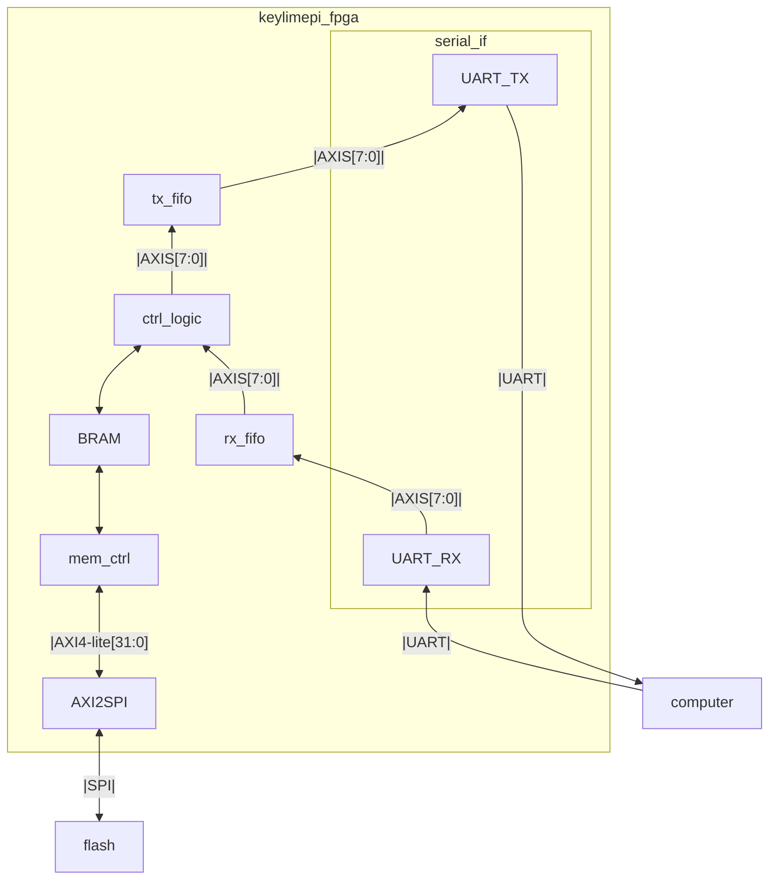

# FPGA Code
- Vivado 2025.2
- Chip name: XC7S50CSGA324-1
## Block Design
Below is a block design of the full FPGA code and what it interacts with.

## Known Issues
- The address is limited to 8 bits, so not used to the fullest possible 12 bits.
- Would like to support timeouts and other errors the rtl detects to prevent hanging in python and support error codes.
- Always expects 64 bytes is written or read at a time, in the future could maybe have an extra byte or two that gives length of data to avoid wasting cycles with empty bytes
## How to Build
```bash
cd build/scripts
# Make sure you have vivado in your environment variables
vivado -mode batch -source keylimepi_fpga.tcl
cd ..
vivado keylimepi_fpga.xpr
```
### If not using Vivado 2025.2
- You do not have to upgrade, but always best
- If not:
  - Ignore the errors when running the build script, the project shpuld still build fine
  - Make sure you upgrade the IP by reporting IP in the report section at the top
